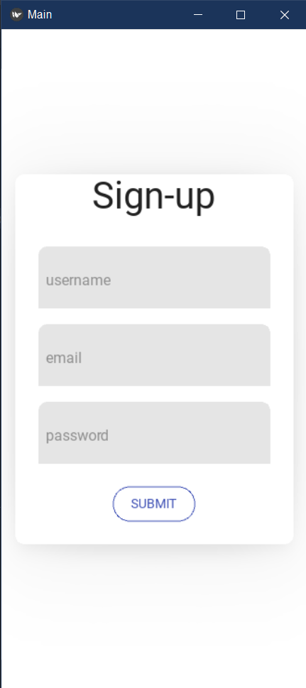

Modern UI Designs using Python's kivy library

# KivyMD-Dashboard-UI

A nice clean dashboard UI design 6 custom icons with inside 6 cards with smooth edges and creative colors.
## requirements

`pip install kivy`
`pip install kivymd`

